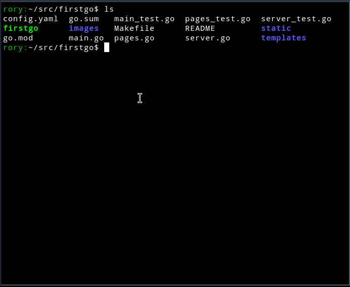

# firstgo

A web server for prototyping web interfaces using sketched page images
and clickable zones to move between pages.



## Howto

1. sketch some images and save them as jpgs or gifs in `images/`
2. work out where the clickable zones are for each image (gimp works well)
3. record each image and clickable zones in the `config.yaml` file.

The config file might look something like this:

```yaml
pageTemplate: "templates/page.html"
pages:
  -
    URL: "/home"
    Title: "Home"
    ImagePath: "images/home.jpg"
    Zones:
      -
        Left:   606
        Top:    33
        Right:  761
        Bottom: 69
        Target: "/about"
      -
        Left:   61
        Top:    202
        Right:  611
        Bottom: 247
        Target: "/detail"
  -
    URL: "/detail"
    Title: "Detail"
    ImagePath: "images/detail.jpg"
    Zones:
      -
        Left: 498
        Top:  14
        Right: 620
        Bottom: 56
        Target: "/home"
```

## Command

The `firstgo` command has the following options:

```
Usage of ./firstgo:
  -address string
    	server network address (default "127.0.0.1")
  -port string
    	server network port (default "8000")
  <configFile>
    	yaml configuration file

run a "firstgo" webserver to show interactive image "pages".

This programme uses the configuration in config.yaml and images in the
images directory and css in the static directory to serve up interactive
image "web pages" to mock up a web site or service.

eg ./firstgo [-address 192.168.4.5] [-port 8001] <configfile>
```

## Licence

This project is licensed under the [MIT Licence](LICENCE).
