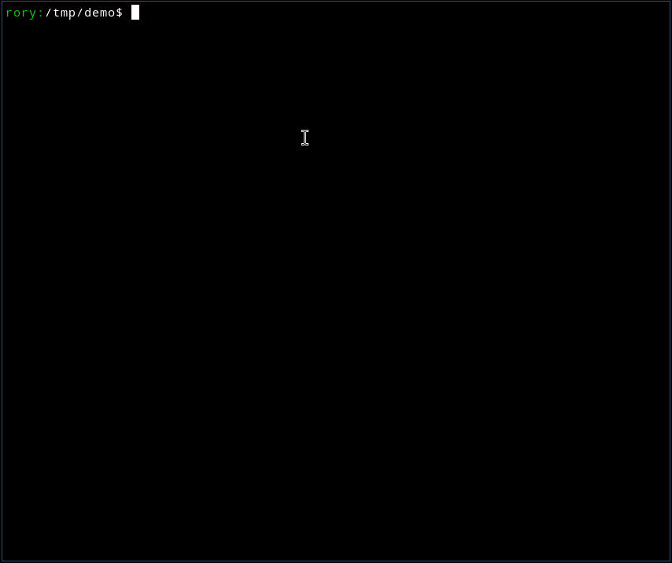

# firstgo

A web server for prototyping web interfaces using sketches and clickable
zones to move between pages.



## Why

If you are developing a web site or service, perhaps through domain
driven design [techniques](https://en.wikipedia.org/wiki/Event_storming),
starting to put together concept sketches that elucidate the "nouns" and
the "verbs" of a system can be very useful to validate the design. Using
sketches also helps separate technical implementation from the
all-important domain concepts.

## Howto

Download the `firstgo` binary for your platform from
[releases](https://github.com/rorycl/firstgo/releases).

`firstgo` runs in `demo`, `init` or `serve` modes:

* **demo**:  
  run the embedded demo to get a feel for how `firstgo` works  
  just run `./firstgo demo` to serve on 
  [http://127.0.0.1:8000](http://127.0.0.1:8000)
* **init**:  
  write the demo project files to disk as a scaffolding for your
  project   
  just run `./firstgo init` to write the files to the current working
  directory
* **serve**
  serve project files on disk  
  just run `./firstgo serve config.yaml` to serve on 
  [http://127.0.0.1:8000](http://127.0.0.1:8000)

To deploy your custom content in production, either copy your project
files with the binary to your production setting, or copy your project
yaml and corresponding images, static and templates material to the
`assets` directory and recompile the binary to embed them.

## Configuration

The provided example configuration file sets out the images representing
"pages" and the clickable area on each. Each "Zone" is the top left and
bottom right of a rectangle. Notes can be added at the bottom of each
image in markdown format.

See the provided [config.yaml](./config.yaml) for an example.

The styling and render templates by be altered by simply editing the
provided files in the `static` and `templates` directories respectively.

If no pages are configured to be served from `/` and `/index` these
endpoints will be automatically provided with a simple index.

## Run

The `firstgo` command has the options shown below with `./firstgo -h`.
Invoke a command with `-h` to see its specific help, such as `./firstgo
serve -h`.

```
Usage:
  firstgo 

A web server for prototyping web interfaces using sketches and clickable
zones to move between pages.

 <demo | init | serve>

Help Options:
  -h, --help  Show this help message

Available commands:
  demo   Run the demo server
  init   Init a project
  serve  Serve content on disk with the provided config

```

## Licence

This project is licensed under the [MIT Licence](LICENCE).
