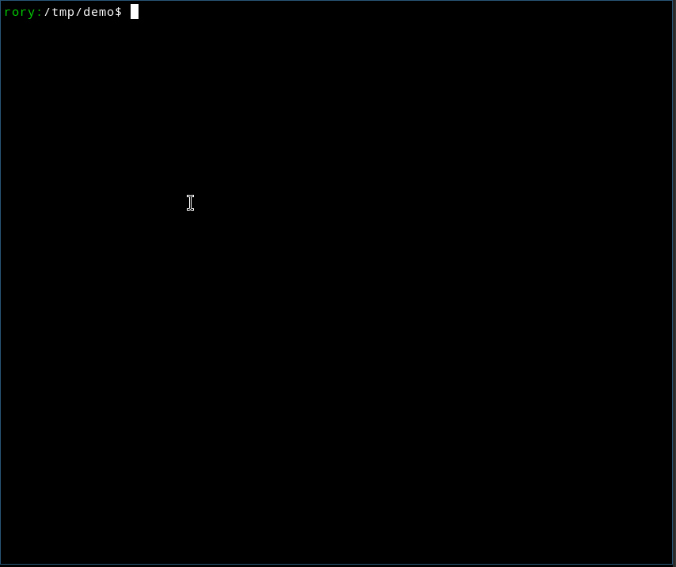

# recording zones

For recording clickable zones on images, consider using a tool like
[LabelImg](https://github.com/HumanSignal/labelImg). Alternatively a
simple bash script using `qiv` and `slop` is provided at
[zone-recorder.sh](utils/zone-recorder.sh). A script for building
cross-platform binaries is also provided.

## Using zone recorder

The zone recorder script is best run from the root of the project (i.e.
above assets), using the following steps:

1. use `./firstgo init` if necessary to create the project scaffolding
2. remove the existing images from the images directory  
   `rm assets/images/*`
3. copy your images to `assets/images/`
4. remove or move the current config file  
   `mv config.yaml /tmp/`
5. run the zone-recorder script  
   `./utils/zone-recorder.sh config.yaml assets/images/*`
6. now step through the images using the image viewer `qiv` and the
   selection tool `slop`.  
   Note that the *Target URL* should be the image minus its suffix.
7. the resulting config.yaml file should be ready to run.  
   `./firstgo serve config.yaml` will report any issues.
8. now consider customising the content of the yaml, assets/static/styles.css
   file and templates in assets/templates/.

Here is an animated gif of the process.

